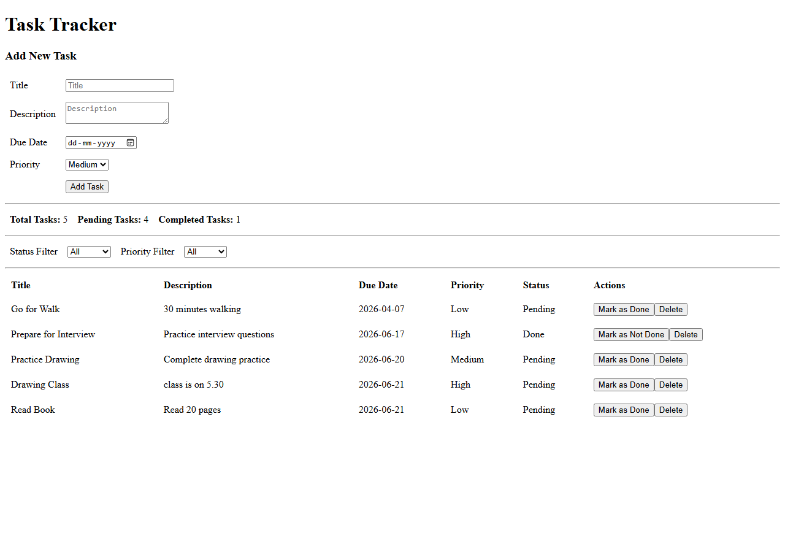
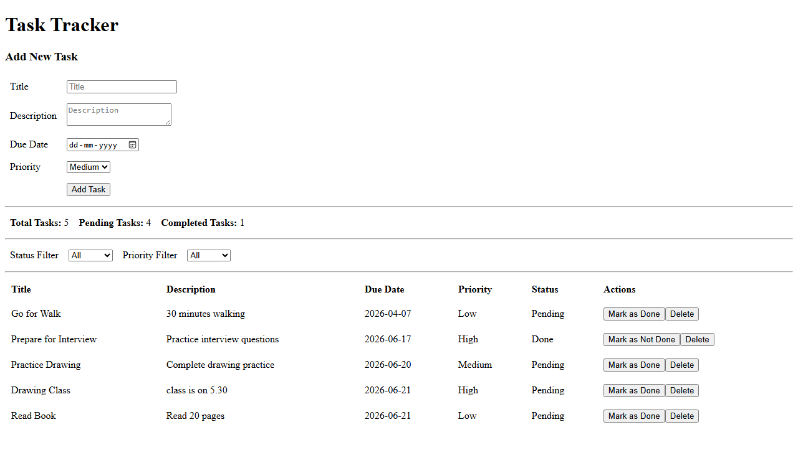
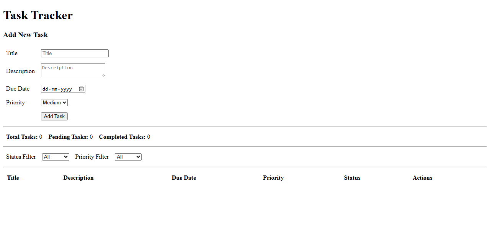

# Marek Task Tracker

## About the Project

Marek Task Tracker is a simple task management application developed as part of an assignment.

The application allows users to:

* Create tasks
* View all tasks
* Mark tasks as completed
* Mark tasks as pending
* Delete tasks
* Filter tasks by status and priority
* View task statistics

Task data is stored in a PostgreSQL database, and the application uses a Node.js REST API to communicate between the frontend and database.

---

## Technologies Used

### Frontend

* Angular
* TypeScript

### Backend

* Node.js
* Express.js

### Database

* PostgreSQL

### Version Control

* Git
* GitHub

---

## Features

* Add new tasks
* View existing tasks
* Update task status
* Delete tasks
* Filter by:

  * All Tasks
  * Pending Tasks
  * Completed Tasks
  * Priority (Low, Medium, High)
* Task statistics

  * Total Tasks
  * Pending Tasks
  * Completed Tasks

---

## Project Structure

```text
frontend/
  Angular application

backend/
  Express API and PostgreSQL connection

database/
  PostgreSQL task table
```

---

## Database

The application uses a PostgreSQL database with a single table called:

```text
tasks
```

Main fields:

* id
* title
* description
* due_date
* priority
* is_done
* created_at

---

## API Endpoints

| Method | Endpoint              | Description        |
| ------ | --------------------- | ------------------ |
| GET    | /api/tasks            | Get all tasks      |
| GET    | /api/tasks/:id        | Get task by ID     |
| POST   | /api/tasks            | Create task        |
| PUT    | /api/tasks/:id        | Update task        |
| DELETE | /api/tasks/:id        | Delete task        |
| PATCH  | /api/tasks/:id/toggle | Change task status |

---

## Installation

### Clone Repository

```bash
git clone <repository-url>
```

### Backend

```bash
cd backend
npm install
npm start
```

### Frontend

```bash
cd frontend
npm install
ng serve
```

### Database

Create PostgreSQL database:

```sql
CREATE DATABASE task_tracker;
```

Run the schema file provided in the project.

---

## Screenshots

### Home Page



### Add Task



### Task Filters



### Database Table

The PostgreSQL `tasks` table is defined in `backend/db/schema.sql`. A database table screenshot can be added here if required by the evaluator.

---

## Challenges Faced

During development I faced a few challenges:

* Connecting Angular with the backend API
* Managing PostgreSQL database connections
* Handling task status updates without affecting due dates
* Implementing filters and statistics

These issues were resolved through testing and debugging.

---

## Future Improvements

If more time is available, the following features can be added:

* Edit Task functionality
* Search tasks
* User authentication
* Better UI design
* Application deployment

---

## Conclusion

This project demonstrates a complete full-stack application using Angular, Node.js, Express, and PostgreSQL.

The application successfully performs task creation, viewing, status updates, deletion, filtering, and data storage while meeting the assignment requirements.
